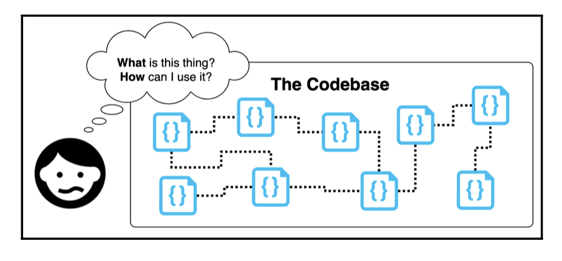
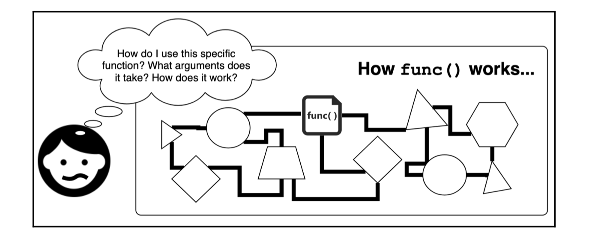
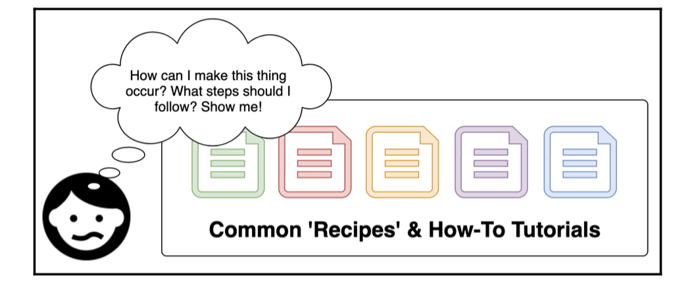
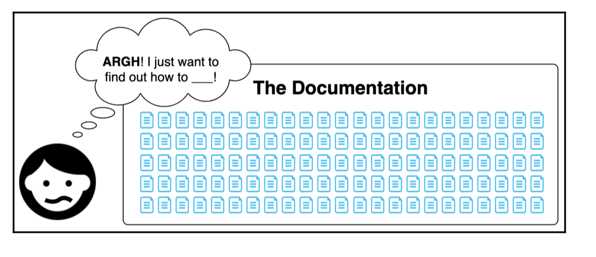

# Documenting Your Code

Documentation  Your Code

## Table of Contents

- [Introduction](#introduction)
- [Aspects of Clean Documentation](#aspects-of-clean-documentation)
  - [Concept](#concept)
  - [Specification](#specification)
  - [Instruction](#instruction)
  - [Usability](#usability)
- [Writing for non-technical audiences](#writing-for-non-technical-audiences)

## Introduction

Documentation has a bad reputation, but it doesn't have to be that way. In this README, we'll explore the importance of clean documentation and how it can benefit both users and developers. We'll cover various aspects of clean documentation, including the concept, specification, instruction, and usability.

## Aspects of Clean Documentation

Clean documentation can be broken down into four aspects: `concept`, `specification`, `instruction`, and `usability`.

### Concept

A clean piece of documentation should effectively communicate the underlying concept of the software. It should explain the purpose of the software and how users can make use of it. To achieve this, it's important to determine your audience, their understanding of the problem domain, and the appropriate level of abstraction and analogies to use.

To express software concepts properly, it's essential to empathize with users, understand their perspective, and communicate with them using terms they can relate to:

1. **Determine your audience**: Identify who your audience is and assess their general technical proficiency.

2. **Evaluate their understanding of the problem domain**: Assess their existing knowledge about the specific software project, API, or codebase. Determine the appropriate level of abstraction and find analogies that resonate well with their current knowledge.

Writing good documentation involves considering the user's perspective and creating suitable abstractions. This process is remarkably similar to crafting clean code, as both aim to provide users with a tool to accomplish specific tasks.

**For example** :
Let's take a JavaScript library called SuperCoolTypeAnimator as an example. It enables programmers to create animated transitions between different typefaces. The codebase is complex, involving ligatures, serifs, and path interpolation. However, as the developer, it can be challenging for you to put yourself in the shoes of a user without your level of expertise.

#### Initial Draft

In such cases, the initial draft of your documentation might look like this:

> SuperCoolTypeAnimator is an SVG glyph animation utility that allows you to create and manipulate transitions between source and target glyphs, calculating transitional anchors on the fly.

#### Simplified Alternative

Now, let's compare it to a simpler alternative:

> SuperCoolTypeAnimator is a JavaScript library that makes it easy to animate text from one typeface to another.

The simpler introduction is more accessible and immediately conveys the purpose of the library, even to non-expert users. The first introduction, while informative, may confuse or alienate potential users. When building software, our goal is to simplify complexity and present it in a user-friendly manner. We should be mindful of burdening users with unnecessary complexity and strive to communicate in a way that aligns with their understanding.

#### Key Concept: Showing Benefit to Users

The key concept in documentation is to show users how our software can benefit them. To achieve this, we need to describe it in a way that resonates with their existing knowledge and comprehension.

---

### Specification

Good documentation should provide a specification that details the behaviors and characteristics of the software interfaces. The specification answers specific questions that users might have about how the code works. It should be clear, correct, and provide enough information to allow users to make use of the software.

Writing a specification should ideally be straightforward for the following reasons:

1. **It's literally in the code**: The behavior specification is already present in your code and its tests. It should be relatively simple to extract this information and document it. If it becomes challenging to write the specification, it may indicate underlying complexities in your code that should be addressed.

2. **It's possible to automatically generate**: There are documentation generators available that can generate documentation for your interfaces based on static-typing annotations or comment annotations (e.g., JSDoc). These tools allow you to generate documentation through a CLI or build tool, saving you time and effort.

3. **It follows a fixed format**: Specifications typically follow a straightforward format with headings for individual endpoints or method signatures, along with an explanation for each argument. This format is easy to author and provides a clear structure for the documentation.

Here's an example of a specification for a function called removeWords: [removeWords](removeWords.js)

When writing the specification, focus on clarity and correctness. Avoid these common pitfalls:

- **Insufficient information**: Ensure that you provide enough information for users to understand and use your software effectively. Simply specifying argument types may not be enough, especially if the knowledge domain is obscure. Consider providing additional context or explanations.

- **Incorrect or outdated information**: Documentation can become outdated or contain incorrect information. To mitigate this, consider generating documentation automatically from annotated code, reducing the chances of discrepancies.

- **Lack of examples**: Providing examples or linking to tutorial-like documentation can significantly enhance user understanding and minimize confusion. Don't limit your specification to just listing modules, methods, and argument signatures.

**Remember**, the specification is a critical part of your documentation, as it clearly explains the behavior of your software's APIs. Take care and be diligent when documenting your code, ensuring that the specification is accurate, comprehensive, and user-friendly.

---

### Instruction

In addition to the concept and specification, clean documentation should provide instructions on how to accomplish common tasks. Instructions can take the form of walkthroughs, tutorials, or how-to guides. They should include upfront expectations, specific steps to follow, and an achievable and observable goal. Instructions help users navigate the software and achieve their desired outcomes.

1. **Clarity and Conciseness**: Instructions should be clear, easy to understand, and free from ambiguity. Use simple language, avoid jargon, and break down complex tasks into manageable steps.

2. **Relevance to User Needs**: Focus on addressing common use cases and tasks that users are likely to encounter. Understand your users' needs and provide instructions that help them achieve their specific goals.

3. **Step-by-Step Guidance**: Provide a detailed, sequential series of steps that users can follow. Make sure instructions are comprehensive, leaving no room for confusion or guesswork.

4. **Observable Goals and Feedback**: Clearly define the expected outcome at each step, allowing users to validate their progress. Provide feedback or indicators to confirm successful completion of each step, such as expected outputs or visible changes.

5. **Contextual Explanations**: Help users understand not only what to do but also why it matters. Provide explanations, rationale, and benefits for each step to enhance users' understanding and engage their motivation.

6. **Prerequisites and Expectations**: Clearly state any prerequisites, hardware or software requirements, and expectations users should meet before starting the instructions. This ensures users are adequately prepared and can successfully follow the steps.

7. **Usability and Accessibility**: Design the documentation to be user-friendly and accessible. Use clear headings, formatting, and visual aids to improve readability. Consider different learning styles and provide multiple formats, such as written instructions, diagrams, screenshots, or video tutorials.

While all these aspects are important, their relative importance may vary depending on the specific context and the needs of your users. It's essential to strike a balance and prioritize elements that will have the greatest impact on helping users accomplish their tasks successfully.

---

### Usability

Usability is the final component in clean documentation. Just like our software, our documentation must be concerned with users and their specific needs. The previous three aspects (concept, specification, instruction) have focused on content, while usability is purely about the way in which we express that content. It's vitally important not to overwhelm or confuse user when they learn about your software:

1. **Too much content**: This can overwhelm a user who may only want to perform some specific and narrow task. They may not see the point in crawling through reams of documentation just to implement their simple task.

2. **Too little content**: If a user wishes to do something that is not documented sufficiently, then they are left with few options. They either have to hope that there is community-driven documentation somewhere or that the interfaces are understandable enough to decipher without help.

3. **Internal inconsistency**: This is common when there are different areas of documentation that have been updated at different times. A user is left wondering which document or example is correct and up to date.

4. **Lacking structure**: Without structure, a user cannot easily navigate through or gain a conceptual understanding of, the entire software. They are left crawling through the details without able to get a clear big picture. Hierarchy is important in software, so it's important to reflect this in our documentation.

5. **Difficult to navigate content**: Without good UX/UI considerations, documentation can be very hard to navigate through. If it is not centralized, searchable, and accessible, then navigation suffers and users are left in a state of confusion and pain.

6. **Lacking presentation**: Alongside navigation, another crucial UX component within documentation is its aesthetic and typographic layout. A well laid-out document is a breeze to read through and learn from. It is entirely reasonable to design documentation. It should not be a dry dumping ground of endless prose, but a beautiful educational experience!

---

### Writing for non-technical audiences

When writing documentation for non-technical audiences, it's important to consider the following:

1. **Pick the right level of abstraction**: Understand the audience's background and proficiency to determine the appropriate level of detail. Use analogies and examples that resonate with their roles and knowledge. For instance, when explaining medical software to a patient, use language like "add your medical information" instead of "populate the medical profile fields."

2. **Avoid overly-technical terminology**: Steer clear of jargon and technical terms that may be unfamiliar to the audience. Use plain and accessible language to explain complex concepts. For example, instead of referring to "CSS modifications," you can talk about "visual enhancements."

3. **Get constant feedback**: Don't assume that your audience understands the information simply because they don't voice any confusion. Seek feedback and confirmation to ensure clarity. Incorporate user-oriented prompts in your documentation or software, such as options to rate helpfulness or provide feedback (e.g., "Was this message helpful? [YES] [NO]").

Communicating with non-technical individuals is a common challenge, but it follows the same principles as communication with anyone else. It's essential to meet people where they are and adapt your communication style to their understanding of the subject matter.
